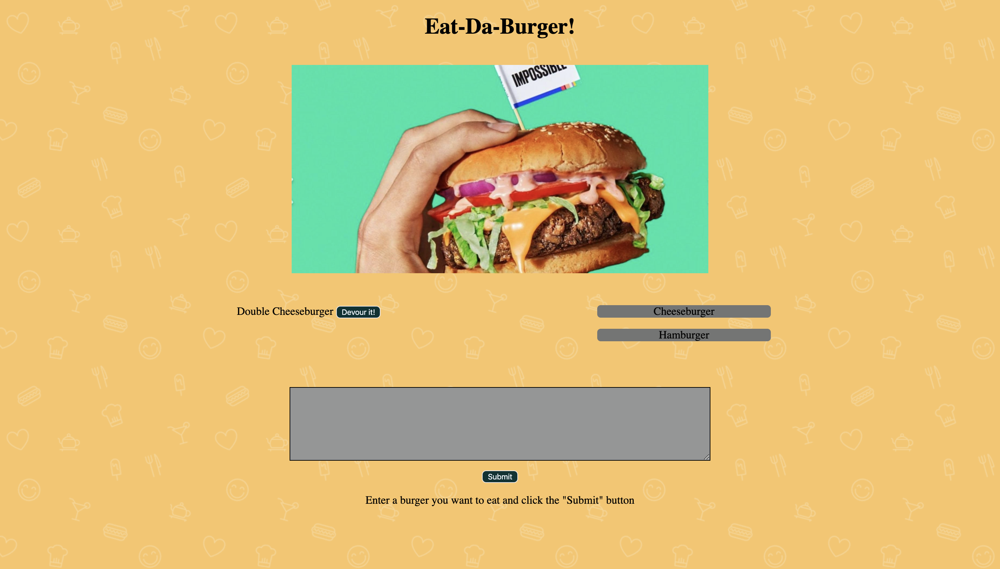

# Eat-Da-Burger
[Burger Deploy Application!](https://lit-crag-62543.herokuapp.com/) - https://lit-crag-62543.herokuapp.com/

* Eat-Da-Burger! is a restaurant app that lets users input the names of burgers they'd like to eat.

* Whenever a user submits a burger's name, burger name will list on the left side of the page --waiting to be devoured.

* Each burger in the waiting area also has a Devour it! button. When the user clicks it, the burger will move to the right side of the page.

* and burger name will be saved in database, whether devoured or not.
